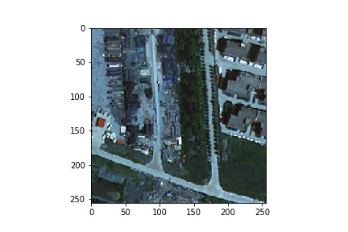
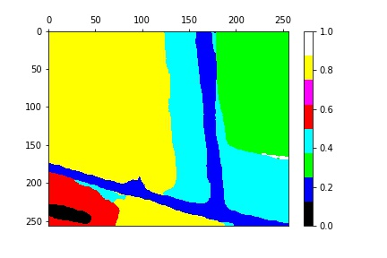
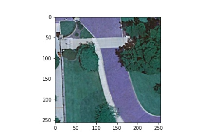
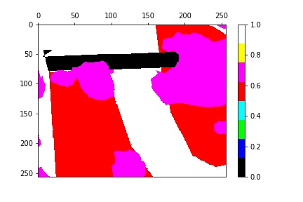

# HR-Net for Remote Sensing Images Instance Segmentation







The environment is on Linux + GPU

Any questions or discussions are welcomed!

## Code Structure

Below is a quick overview of the function of each file.

```bash
########################### Data ##############################################################

train/                           	# default folder for the dataset
    images/                  	 	# folder for images in the dataset
    labels/			 	# folder for labelss in the dataset
test/                            	# default folder for storing the output during training
    image_B/                  	 	# folder for ShanghaiTech dataset (Huang et al.)
    results_B/                   	# folder for ShanghaiTech dataset (Huang et al.)

########################### Code ##############################################################
libs/                           	# libs module so you can "import libs" in other scripts
    nn/                         	 
    	parallel/			# functions for wrapping the network during training
		data_parallel.py	
        modules/                	# functions for synchronized batchnorm over multiple GPU devices
		batchnorm.py		 
		comm.py	
		replicate.py
		unittest.py
    metric.py                   	# functions for evaluation metrics
    lr_scheduler.py             	# different learning rate schedulers
    average_meter.py            	# functions for averaging the training loss
models/
    hrnet_v2/                   
	HRNet.py			# neural network structure
dataloader.py                   	# script for pre-processing the dataset
train_hrnet.py                  	# script for training the neural network
predict_hrnet.py                	# script for post-processing and inferencing the model
```

## Reproducing Results

### Installation

For the ease of reproducibility, you are suggested to install [miniconda](https://docs.conda.io/en/latest/miniconda.html) (or [anaconda](https://www.anaconda.com/distribution/) if you prefer) before following executing the following commands. 

```bash
git clone https://github.com/Joooshua/RSImageInstanceSegmentation
conda create -y -n RSImage
conda activate RSImage
# Replace cudatoolkit=10.1 with your CUDA version: https://pytorch.org/
conda install -y pytorch cudatoolkit=10.1 -c pytorch
conda install -y tensorboardx -c conda-forge
pip install requirements.txt
```

### Pre-trained Models

You can download our reference pre-trained models from [Baidu Netdisk](https://pan.baidu.com/s/1Zbsd-NAI9MGXVGCwCjd2sg) (code: 64h8).

### Downloading the Processed Dataset

Make sure `curl` is installed on your system and execute.

You can download the training dataset into directory './train'

And download the Image A/B testset into directory './test'

### Testing

Running python predict_hrnet.py in this directory to generate mask for different geographic classes.
        
```bash
python predict_hrnet.py
```


### Model Training

Running python train_hrnet.py in this directory.

```bash
python train_hrnet.py
```
