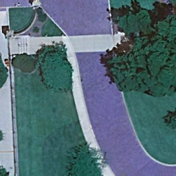

# HR-Net for Remote Sensing Images Instance Segmentation

The environment is on Linux + GPU

Any questions or discussions are welcomed!

## Directories
The training dataset is in './train', where

(1)'./train/images' contains images in the dataset

(2)'./train/labels' contains labels in the dataset

The training dataset can be shown

The test set is in './test', where

(1)'./test/image_B' contains images for the testing

(2)'./test/results_B' contains labels generated using our models

In directory 'models/', High-Resolution Nets used for this task is defined as HRNetV2(n_class)

## Testing  ——  predict_hrnet.py

Downloading the pretrain_model [Baidu Netdisk](https://pan.baidu.com/s/1Zbsd-NAI9MGXVGCwCjd2sg) (code: 64h8)

Chaning the parameters 'weight_path' in './predict_hrnet.py'

Running python train_hrnet.py in this directory
        
        input_path:     The directory containing test images (default: './test/image_B/')
        			You can change it in 'predict_hrnet.py'

        output_path:    The directory where the results are written into (default: './test/results_B/')
		        	You can change it in 'predict_hrnet.py'
        
        model:          The model used (default: HRNetV2(n_class))
        
        matches：       The type of results we generate for each class (default: [100, 200, 300, 400, 500, 600, 700, 800])
        			You can change it in 'predict_hrnet.py'

        weights_path：  The path of the downloaded weight file

## Model Training  ——  train_hrnet.py

Running python train_hrnet.py in this directory

        model:          The model used (default: HRNetV2(n_class))
	                	You can use other models by adding models into './models'

        image_folder:   The directory containing training images (default: './train/images')
				You can change it in './dataloader.py'

        label_folder:   The directory containing training labels (default: '/train/labels')
	              		You can change it in './dataloader.py'

        n_class:        The number of instance classes (default: 8)
	            		class_names = ['water', 'transportation', 'architecture', 'cultivated', 'grassland', 'forest', 'soil', 'others']
	            		You can change it in './train_hrnet.py'

        batch_size:  	The batch size for training (default: 64)
	             		You can change it in './dataloader.py'

        weight_path：   The weight path for pre-trained model weights (default: None)
				You can set it in './train_hrnet.py'
